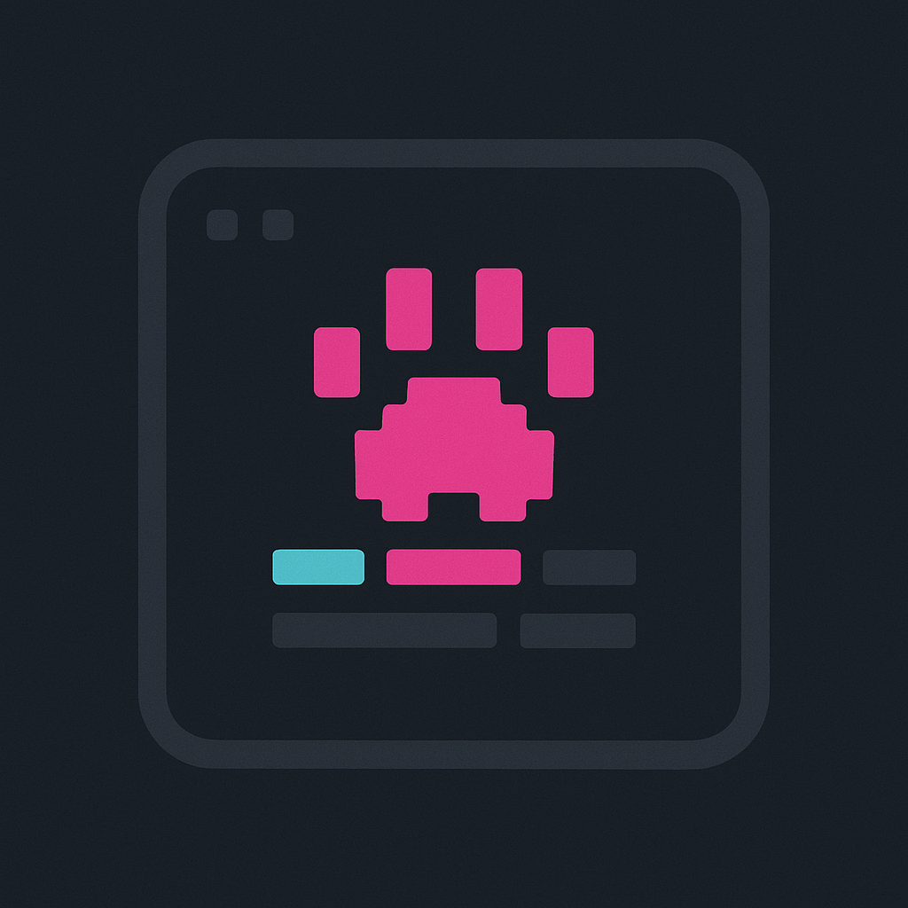

<p align="center">
  
</p>

<h1 align="center">clawtop</h1>

<p align="center">
  A dense TUI dashboard for your Anthropic Claude usage.<br />
  Single PC or many. Credentials never leave the machine that already holds them.
</p>

<p align="center">
  <a href="https://github.com/leonardorifeli/clawtop/releases/latest"></a>
  <a href="https://github.com/leonardorifeli/clawtop/actions/workflows/ci.yml"></a>
  <a href="https://github.com/leonardorifeli/clawtop/blob/main/LICENSE"></a>
</p>

---

```
clawtop · 19:23:04 · hosts 2 (omen,pop-os) · plan team · window 7d              fresh
──────────────────────────────────────────────────────────────────────────────────────
SESSION  ██████████▒▒▒▒▒▒▒▒▒▒▒▒▒▒▒▒▒▒▒▒▒▒▒▒▒▒▒▒▒▒▒▒▒  31.0%  · resets 29m
WEEK     █▒▒▒▒▒▒▒▒▒▒▒▒▒▒▒▒▒▒▒▒▒▒▒▒▒▒▒▒▒▒▒▒▒▒▒▒▒▒▒▒▒   5.0%  · resets 6d 8h
──────────────────────────────────────────────────────────────────────────────────────
TOP PROJECTS (last 7d)                       MODELS
rifeli              1.9M ████████████▒▒▒▒▒   opus-4-7                       4.5M
  omen 1.9M · pop-os 18.0k                     in 200.8k · out 4.3M · cache 100% · 32 sess
rifeli.dev        874.4k ███████▒▒▒▒▒▒▒▒▒▒
  3 sessions
main-flora        731.2k ██████▒▒▒▒▒▒▒▒▒▒▒
  2 sessions
nzomukongo        396.4k ███▒▒▒▒▒▒▒▒▒▒▒▒▒▒
  6 sessions
jarvis-text-anls. 195.0k ██▒▒▒▒▒▒▒▒▒▒▒▒▒▒▒
  omen 151.2k · pop-os 43.8k
──────────────────────────────────────────────────────────────────────────────────────
HOSTS  omen 3.5M·7p·20s·fresh   pop-os 1.0M·8p·12s·fresh
──────────────────────────────────────────────────────────────────────────────────────
TOP SESSIONS
  rifeli                 1.2M     opus-4-7      · 2h ago
  rifeli                 201k     opus-4-7      · 14m ago
  rifeli.dev             196k     opus-4-7      · 3h ago
──────────────────────────────────────────────────────────────────────────────────────
24h ▁▁▁▁▁▁▁▁▁▁▁▁▁▁▁█▄▁▁▁▁▁█        1.6M · peak 507.1k
 7d ▁▂▃▄▅█▃                          4.5M · peak 1.6M
t tabbed · f filter host · j/k scroll · g/G top/end · r reload · q quit
```

## Quickstart — single PC

You run Claude on one machine and want a dashboard on that same machine.

```bash
# 1. Install binaries + systemd unit files.
curl -fsSL https://raw.githubusercontent.com/leonardorifeli/clawtop/main/install.sh | sh

# 2. Verify everything is wired correctly.
clawtopd doctor
# OK    credentials   ~/.claude/.credentials.json   subscription=max
# OK    anthropic     api.anthropic.com             session=12.1% week=4.3%
# OK    destination   local:~/.local/share/clawtop  writable

# 3. Enable the daemon.
systemctl --user daemon-reload
systemctl --user enable --now clawtopd-local

# 4. Open the dashboard.
clawtop --dir=~/.local/share/clawtop
```

That's it. The daemon writes `~/.local/share/clawtop/<machine>.json` once
a minute; the TUI re-reads every second.

## Quickstart — multi PC (N daemons → 1 viewer)

You run Claude on several machines (laptop, desktop, work box) and want
one dashboard that merges them, displayed on a homelab box, a Pi, an old
NUC, or any always-on machine you can SSH into. The OAuth credentials
stay on each Claude machine; only the derived JSON travels.

```bash
# --- On the viewer host (once) ---
sudo install -d -o $USER -g $USER /var/lib/clawtop
curl -fsSL https://raw.githubusercontent.com/leonardorifeli/clawtop/main/install.sh | sh -s -- viewer
systemctl --user daemon-reload
systemctl --user enable --now clawtop                 # launches tmux session
sudo loginctl enable-linger $USER                     # survives logout

# --- On each machine that runs Claude ---
curl -fsSL https://raw.githubusercontent.com/leonardorifeli/clawtop/main/install.sh | sh -s -- daemon
# Edit the unit to set --host=<your-viewer-ssh-alias>
${EDITOR:-vi} ~/.config/systemd/user/clawtopd-remote.service
clawtopd doctor --host=<your-viewer-alias>            # 4 OKs expected
systemctl --user daemon-reload
systemctl --user enable --now clawtopd-remote

# --- Look at it from anywhere ---
ssh <viewer-host>
tmux attach -t clawtop
```

The full multi-PC walkthrough (with SSH setup, troubleshooting, the
common gotchas around SSH alias users and copy-pasted long URLs) is in
[`deploy/INSTALL.md`](deploy/INSTALL.md).

## What it answers

Six tabs, or one dense dashboard view (default when terminal is ≥80×18):

1. **Limits** — 5h and 7d rate-limit windows with reset countdowns, burn-rate
   projection, and a **day-over-day delta** (↑/↓ pp vs ~24h ago) once the
   daemon has built up local history.
2. **Projects** — which working directories ate your token budget over
   the chosen window; per-host attribution when two or more machines
   contributed to the same project; session count per project.
3. **Models** — Opus vs Sonnet vs Haiku split, input/output/cache
   columns, **cache hit rate**, distinct session count per model, and an
   **estimated USD cost** per model, overall, and as a **~$/month run rate**
   (list price — override with `--pricing`).
4. **Hosts** — per-machine totals: tokens contributed, distinct
   projects, distinct sessions, freshness.
5. **Sessions** — top 10 most expensive conversations in the window, each
   with its **AI title** (what it was actually about), a **live dot** for
   sessions touched in the last 5 minutes, per-session **cache hit rate**,
   **estimated cost**, and an **action breakdown** (edits, files touched,
   reads, bash) so you see what was done, not just how many tokens it cost.
   A **⚠ flag** marks sessions that burned tokens but produced no output
   (no edits/files/bash — usually the model spinning). Account-level
   edit/read/bash totals and a live-session count sit in the headers.
6. **Hourly** — 24h sparkline plus 7d daily breakdown.

Press `f` to filter to a single host (cycles through all → omen → pop-os
→ all). Or start with `clawtop --machine=omen` to lock to one machine.

## What it isn't (and what to use instead)

clawtop is one of several open-source tools that read your local Claude
transcripts. Pick the shape that matches your use case:

| Tool | Shape | Best when |
|------|-------|-----------|
| [`ccusage`](https://github.com/ryoppippi/ccusage) | On-demand CLI, prints tables | You want a fast snapshot from the shell |
| [`Claude-Code-Usage-Monitor`](https://github.com/Maciek-roboblog/Claude-Code-Usage-Monitor) | Always-on terminal monitor with burn-rate predictions | You want ML projections on a single host |
| [`ccflare`](https://claudefa.st/blog/tools/monitors/claude-code-usage-monitor) | Browser dashboard | You want graphs you can pan and zoom |
| [`Clawdmeter`](https://github.com/HermannBjorgvin/Clawdmeter) | ESP32 hardware display | You want a physical Clawd on your desk |
| **`clawtop`** | Dense TUI, single PC or **multi-host aware**, displays on any always-on screen | You run Claude on more than one machine, want one place to look, and don't want to copy OAuth credentials around |

If you only run Claude on a single laptop and just want a quick table,
`ccusage` is probably what you want. clawtop earns its keep when you
have several boxes (work laptop + personal desktop + dev VM + homelab)
and want a unified, always-on view.

## Architecture

**Single PC** — the daemon writes a local JSON, the TUI reads it:

```
┌─ your PC ──────────────────────────────────────────┐
│  ~/.claude/.credentials  ─▶ clawtopd  ─▶ ~/.local/share/clawtop/<machine>.json  ─▶ clawtop
│                              │
│                              ▼
│                          api.anthropic.com   (1 Haiku token / minute)
└─────────────────────────────────────────────────────┘
```

**Multi PC** — each daemon pushes its own JSON to a chosen viewer host:

```
┌──────────────┐                          ┌──────────────────┐
│ laptop       │──clawtopd──┐             │ viewer host      │
│              │            │             │                  │
│ ~/.claude/   │            │             │  /var/lib/       │
│ .credentials │            │   ssh push  │   clawtop/       │
└──────────────┘            ├────atomic──▶│   laptop.json    │
                            │             │   omen.json      │
┌──────────────┐            │             │   workpc.json    │
│ omen         │──clawtopd──┤             │        │         │
└──────────────┘            │             │        ▼         │
                            │             │  clawtop (TUI)   │
┌──────────────┐            │             │  inside tmux     │
│ workpc       │──clawtopd──┘             └──────────────────┘
└──────────────┘
        │
        │ HTTPS (1 Haiku token / minute / machine)
        ▼
   api.anthropic.com
```

The daemon polls Anthropic every 60s with `max_tokens: 1` to read the
`anthropic-ratelimit-unified-*` response headers, and walks
`~/.claude/projects/**/*.jsonl` to aggregate per-project, per-model,
hourly, and daily token usage from your local transcripts. The merger
on the viewer side keeps account-scoped fields from the freshest report
and sums everything else element-wise.

## Credentials never travel

`clawtopd` runs as a systemd `--user` service, so it inherits the same
file permissions as your interactive shell. It reads
`~/.claude/.credentials.json` like any other file, then talks to
Anthropic from the same host. The viewer — whether on the same PC or on
a remote box — only sees the derived JSON (rate-limit percentages,
token counts, session metadata). If the viewer host is compromised, the
attacker gets numbers, not the OAuth token.

## Configuration

`clawtopd run` (default subcommand):

| flag | default | what |
|------|---------|------|
| `--host` | `localhost` | `localhost` writes locally; anything else is treated as an ssh_config alias and pushed via SSH |
| `--dir` | `~/.local/share/clawtop` (local) or `/var/lib/clawtop` (ssh) | directory for the per-machine status JSON |
| `--creds` | `~/.claude/.credentials.json` | Claude OAuth credentials file |
| `--machine` | hostname | stable identifier, becomes `<machine>.json` |
| `--projects` | `~/.claude/projects` | transcripts root (honors `$CLAUDE_CONFIG_DIR`) |
| `--window` | `168h` (7d) | aggregation lookback |
| `--interval` | `60s` | poll cadence |
| `--once` | `false` | probe once and exit (smoke test) |
| `--local-only` | `false` | print to stdout instead of writing |
| `--skip-probe` | `false` | skip the Anthropic call, aggregate transcripts only |
| `--alert-session` | `0` (off) | alert when the 5h window reaches this percent |
| `--alert-week` | `0` (off) | alert when the 7d window reaches this percent |
| `--alert-project` | `false` | alert when burn rate projects hitting 100% before reset |
| `--notify-url` | "" | POST alerts to this URL (ntfy topic or generic webhook) |
| `--notify-cmd` | "" | run this command (`sh -c`) per alert; details in `$CLAWTOP_ALERT_*` |
| `--history-dir` | `~/.local/share/clawtop` | local rate-limit history dir (empty disables) |
| `--history-keep` | `720h` (30d) | how long to retain history samples |

`clawtopd doctor` accepts the same flags and runs four preflight checks:
credentials are readable, Anthropic responds, SSH alias is reachable
(if remote), destination is writable.

### Alerts

The daemon can notify you before you hit a wall, so you don't have to watch
the TUI. Alerts **edge-trigger** — each condition fires once when it starts,
then re-arms only after it clears (e.g. the window resets). Every alert is
logged; set `--notify-url` and/or `--notify-cmd` to also push it out.

```bash
# Warn at 80% session / 90% week, and when burn rate projects an overrun,
# pushing to an ntfy topic and a desktop notification.
clawtopd --alert-session=80 --alert-week=90 --alert-project \
  --notify-url=https://ntfy.sh/my-private-topic \
  --notify-cmd='notify-send "$CLAWTOP_ALERT_TITLE" "$CLAWTOP_ALERT_MESSAGE"'
```

`--notify-cmd` is the generic hook: point it at your own script to route
alerts anywhere — Slack, a self-hosted messaging gateway, a pager — without
clawtop needing to know about that channel. How it arrives: on each firing
alert (after the edge-trigger), `clawtopd` spawns the command once via
`sh -c`, passing the alert through environment variables — it does not write
to the command's stdin. Your script reads:

| env var | value |
|---------|-------|
| `$CLAWTOP_ALERT_TITLE` | short headline, e.g. `clawtop: week at 92%` |
| `$CLAWTOP_ALERT_MESSAGE` | full text with pct, threshold/projection, reset countdown |
| `$CLAWTOP_ALERT_LEVEL` | `warning` or `urgent` |
| `$CLAWTOP_ALERT_KEY` | stable id, e.g. `week:threshold` (handy for dedup/routing) |

`--notify-url`, by contrast, needs no script: `clawtopd` POSTs the message as
the request body with `Title`/`Priority` headers (ntfy-shaped).

History is local daemon state; the derived day-over-day deltas travel to the
viewer inside the status payload, so a central viewer shows them without
reading any history file.

`clawtop` (viewer):

| flag | default | what |
|------|---------|------|
| `--dir` | `/var/lib/clawtop` | directory of per-machine status JSON files |
| `--machine` | "" (all merged) | show only the named machine's data |
| `--pricing` | "" (built-in) | JSON file overriding the per-million-token USD price estimates (see below) |

Cost figures are **estimates** computed from token counts using public
list prices (Opus $5/$25, Sonnet $3/$15, Haiku $1/$5 per 1M in/out; cache
read ≈0.1×, cache write ≈1.25× input). They ignore plan discounts and can
drift when prices change — always validate against your billing source.
Override with a partial JSON map:

```json
{ "opus": { "in": 5, "out": 25, "cache_read": 0.5, "cache_write": 6.25 } }
```

Key bindings: `tab`/`shift-tab` or `←`/`→` cycle tabs, `1`–`6` jump
directly, `t` toggle dashboard/tabbed, `f` cycle host filter,
`j`/`k`/`g`/`G`/`PgUp`/`PgDn` scroll the project list, `r` reload, `q`
quit.

## Status JSON (schema 5)

```json
{
  "schema": 5,
  "machine": "omen",
  "ts": 1716688320,
  "session": { "pct": 31.0, "reset_at": 1716700000, "prev_day_pct": 22.0 },
  "week":    { "pct":  5.0, "reset_at": 1717100000, "prev_day_pct":  4.0 },
  "has_history": true,
  "limit":   "allowed",
  "subscription": "team",
  "window":  "7d",
  "sessions": 20,
  "by_project": [
    { "name": "rifeli", "path": "/home/rifeli/projects/personal/rifeli",
      "in": 12345, "out": 1900000, "cache_read": 45e6, "cache_create": 1.4e6,
      "sessions": 5 }
  ],
  "by_model": [
    { "model": "claude-opus-4-7",
      "in": 200800, "out": 4300000, "cache_read": 462500000, "cache_create": 14600000,
      "sessions": 32 }
  ],
  "hourly_24h": [0, 0, 0, 0, 0, 0, 0, 0, 0, 0, 0, 0, 0, 0, 0, 107835, 7436, 0, 0, 0, 0, 0, 0, 178055],
  "daily_7d":   [120000, 250000, 80000, 400000, 600000, 1100000, 1300000],
  "edits": 144, "reads": 164, "bash": 466,
  "top_sessions": [
    { "id": "abc-...", "project": "rifeli", "model": "claude-opus-4-7",
      "in": 186931, "out": 966588, "cache_read": 11664069, "cache_create": 240000,
      "title": "Troubleshoot DVR camera configuration",
      "edits": 14, "reads": 4, "bash": 22, "files_touched": 7,
      "started_at": 1716680000, "last_at": 1716688000 }
  ]
}
```

Tiny payload (~1–5 KB per machine), self-describing, forward-compatible.
Old viewers ignore unknown fields; new viewers default-zero missing ones.

## Repo layout

```
clawtop/
├── cmd/
│   ├── clawtop/        # TUI binary
│   └── clawtopd/       # daemon binary + doctor subcommand
├── external/           # adapters to the outside world
│   ├── anthropic/      # API client (creds + probe)
│   └── push/           # Pusher interface + Local + SSH implementations
├── internal/
│   ├── domain/         # on-the-wire entities
│   └── service/        # business logic
│       ├── collector/  # parse transcripts → aggregate
│       └── merger/     # merge N per-machine payloads
└── deploy/             # systemd units + INSTALL.md
```

## Cost

One Haiku call with `max_tokens: 1` per minute per daemon. On a Max or
Team plan this is billed against the same subscription quota you're
watching and shows up in the very dashboard you're looking at. Three
machines combined add up to a single-digit number of cents per month.

## Contributing

PRs welcome. The whole thing is around 1000 lines of Go. See
[`CHANGELOG`](https://github.com/leonardorifeli/clawtop/releases) for
the release-by-release feature list.

## Credits

This project would not exist without
[Clawdmeter](https://github.com/HermannBjorgvin/Clawdmeter) by
[Hermann Bjorgvin](https://github.com/HermannBjorgvin), which is where I
learned the Anthropic OAuth surface exposes the `unified` rate-limit
headers, and [ccusage](https://github.com/ryoppippi/ccusage) by
[ryoppippi](https://github.com/ryoppippi), which set the bar for what
transcript-derived analysis should look like.

## License

MIT — see [LICENSE](LICENSE).
